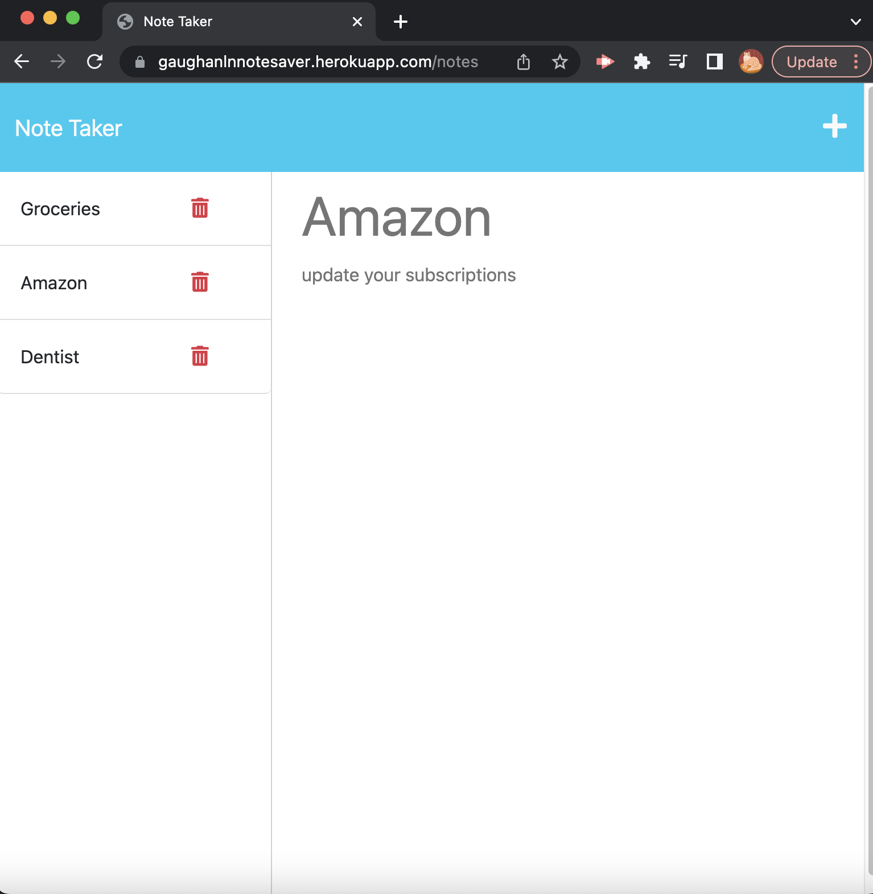

# Note Taker 📝

## Description

This application is used to write and save notes using express.js back end and will save and retrieve note data from the JSON file.

## Criteria:

* A notes page that shows existing notes listed on the left hand side
* When you enter a new note and save it, it will appear on the left hand side with previously saved notes

The following applies to HTML routes:
  * `GET /notes` should return the `notes.html` file.
  * `GET *` should return the `index.html` file.

The following applies to API routes:
  * `GET /api/notes` should read the `db.json` file and return all saved notes as JSON.

  * `POST /api/notes` should receive a new note to save on the request body, add it to the `db.json` file, and then return the new note to the client. 

## End Product 

<!-- screenshots -->
Below is a screenshot of the application in use

<!-- link -->
## Deployment
Here is the [link](https://gaughanlnnotesaver.herokuapp.com/) to the deployed application

## Contributing
Lindsey Gaughan (Me!) 

